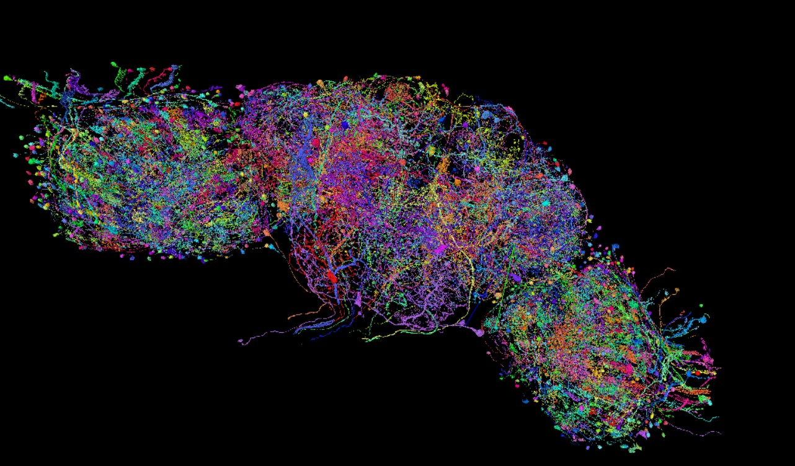
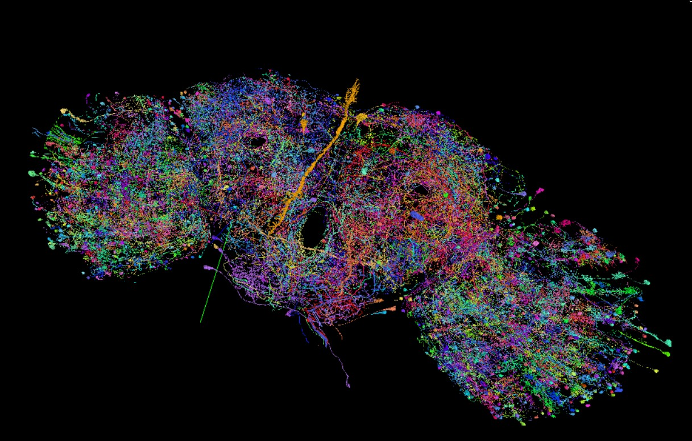
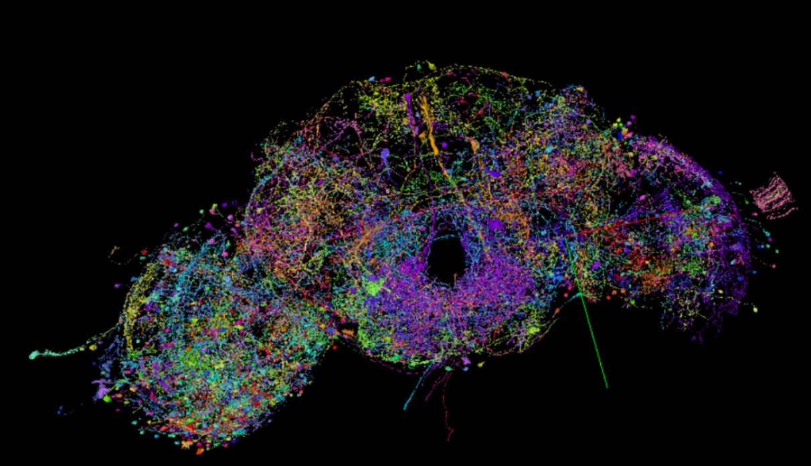
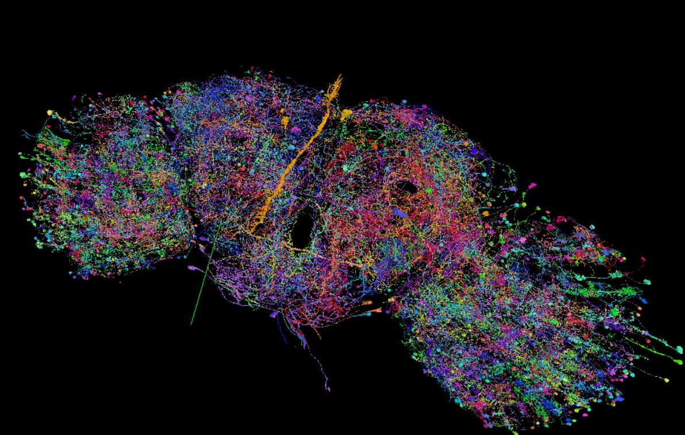

# Figures

This folder contains visualizations of the 14,484-neuron conserved visual circuit, rendered on the FlyWire/Codex Neuroglancer platform.

---

## 3D Brain Visualizations - Neuroglancer / Codex Platform

The following screenshots show the 14,484 identified homologous neurons rendered in 3D on the FlyWire Neuroglancer platform. Each view highlights different aspects of the circuit architecture - the crystalline columnar arrays of the optic lobe, the wide-field integrators, and the connectivity structure of the conserved backbone.

---

## Connectivity Graph - Codex Network View

*Force-directed layout of the complete 14,484-node FAFB induced subgraph rendered via Codex. The dense central cluster reflects the tightly interconnected retinotopic columns of the optic lobe.*

---

## Interactive 3D Visualization

A fully interactive force-directed 3D HTML visualization of the complete 14,484-node subgraph is hosted at:

**[https://siddgud.github.io/14k_interactive_3d_network/14k_interactive_3d_network.html](https://siddgud.github.io/14k_interactive_3d_network/14k_interactive_3d_network.html)**

Features:
- 3D rotation and zoom
- Node hover to inspect neuron IDs
- Edge highlighting to trace individual synapse connections
- Color coding by connectivity density
