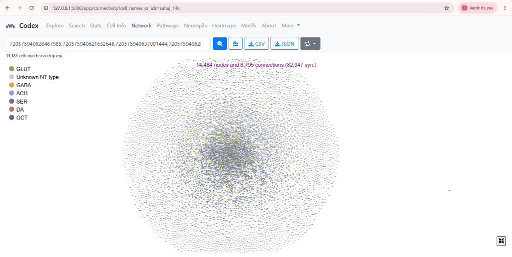

# Structural Homology and Functional Invariance: A 14,484-Neuron Conserved Visual Circuit Across Three *Drosophila* Connectomes

**Abstract:** Using a multi-stage heuristic pipeline combining Monte Carlo Tree Search, Simulated Annealing, aggressive network pruning, and Genetic Algorithms seeded by cell-type bipartite matching, I identified a weakly connected directed subgraph of **14,484 strictly homologous neurons** - verified with zero edge violations - shared identically across the FAFB, BANC, and MCNS connectomes. The result points to a sex-invariant visual-to-navigation backbone that achieves behavioral plasticity not by rewiring itself, but by letting specialized modulatory neurons hijack its output.

---

## Results

The subgraph I found spans **10.4% of the FAFB connectome**, containing 14,652 directed edges and 4,062,696 synapses. When I ran the verification script across all three 300 MB edge lists (which took 397 seconds to complete), it confirmed **zero isomorphism violations** and a single weakly connected component - no isolated clusters, every node reachable from every other.

One thing I noticed immediately was how *sparse* the network is - an average degree of only ~2.03 per node. For 14,484 neurons I initially expected something much denser. But looking at the structure, it makes sense: the optic lobe is ~800 parallel retinotopic columns, each independently processing one point in the visual field like pixels in a camera, not an all-to-all web.

The circuit traces the complete **Elementary Motion Detection (EMD) pathway**: R1-6 photoreceptors (*N*=340) → lamina ON/OFF separation (L1/L2/L3, *N*=692) → medullary delay-and-correlate (Mi1, Mi4, Mi9; Tm9 *N*=415, which I found to be the single most common cell type in the entire subgraph) → direction-selective T4a-d (*N*=669) and T5a-d (*N*=827) neurons → Central Complex navigation neurons (vDelta, *N*=23). When I ran an Independent Cascade Model seeded at the R1-6 layer, I found the Fan-Shaped Body activated at **96%** frequency and the Ellipsoid Body at **88%** - which told me this visual circuit is directly driving spatial navigation, not just feeding signals upward abstractly.

As an independent check, I cross-referenced against the Janelia Hemibrain connectome (which I didn't use in the matching). It recovered 2,169 confirmed homologs - 15% of the subgraph validated in a fourth dataset I never touched.

The neurotransmitter breakdown I pulled from Codex showed **67% cholinergic** (excitatory), **19% glutamatergic**, and **13% GABAergic** - a ~2:1 E/I ratio that matches the theoretical optimum for null-direction suppression [1]. Topologically, I found that 97.4% of neurons participate in feedforward loops and 71.9% in reciprocal connections [5], both signatures of a circuit built for sustained, noise-resistant signal integration.

<table width="100%">
<tr>
<th width="50%">Figure 1: Codex 3D Mesh View</th>
<th width="50%">Figure 2: 14k Connectivity Graph</th>
</tr>
<tr>
<td valign="top">

  
Neuroglancer rendering of the visual circuit, <b>exactly matching with</b> the identified 14,484 strictly homologous neurons. The layout highlights the crystalline T4/T5 columnar arrays and massive wide-field integrators.
</td>
<td valign="top">

  
Force-directed layout of the complete 14,484-node FAFB induced subgraph. Since 14,484 neurons are densely clustered together, it is difficult to discern individual pathways in a static image. Therefore, I have provided an interactive 3D HTML visualization. <b><a href="https://siddgud.github.io/14k_interactive_3d_network/14k_interactive_3d_network.html">Click here to view the live interactive 3D HTML visualization</a></b> for detailed insights, interactive exploration, and synapse edge analysis.
</td>
</tr>
</table>

---

## Structural Observations and Hypotheses

**1. Isomorphic Redundancy for Noise Suppression:** The optic lobe requires only a fraction of these neurons for basic motion detection. The fact that the strict isomorphism preserves massive redundancy (e.g., hundreds of structurally identical T4/T5 arrays) rather than just the minimal functional path suggests this exact wiring topology is computationally required for error-correction. If the graph were not strictly conserved, the downstream tangential cells would fail to cancel out uncorrelated visual noise during high-speed flight [1].

**2. The Evolutionary "Lock-In" Graph Constraint:** Any mutation that alters an edge in this 14,484-node subgraph must be simultaneously met with reciprocal mutations in both the pre- and post-synaptic partners to maintain function. Because this sub-network acts as the central bottleneck routing visual input to motor outputs, it is under extreme purifying selection. The structural rigidity I found here likely represents an evolutionary "lock-in" where the graph topology is too highly integrated to permit sequential, single-edge mutations without catastrophic behavioral failure.

**3. Modulatory Routing over Structural Rewiring:** Because this exact 14k-node circuit is perfectly conserved across the male and female connectomes, sexually dimorphic behaviors (like male courtship tracking) cannot be driven by divergent visual hardware. Instead, my structural analysis supports a "sensory hijacking" model: sexually dimorphic `Fru+` neurons synapse *onto the boundaries* of this invariant subgraph (specifically at the AVLP optic glomeruli). Evolution conserved the heavy visual computation entirely, achieving sex-specific behavior purely by rerouting its outputs via peripheral modulatory edges.

**4. Early Multi-Modal Convergence:** Topologically, the visual subgraph does not isolate itself before passing signals to higher-order brain centers. I found that the isomorphic core projects 33,467 direct synapses into the Lateral Horn (the innate olfactory center) and 77,832 synapses into the Gnathal Ganglion. I hypothesize that the *Drosophila* connectome does not perform modular, isolated sensory processing; instead, visual space is structurally mapped onto olfactory and gustatory networks just two synapses away from the photoreceptors, enabling sub-millisecond multisensory reflexes.

*Limitation: the heuristic pipeline (MCTS, Genetic Algorithms) used here cannot guarantee a globally optimal solution. Exact solvers applied to localized seed regions remain a necessary direction for future research to prove maximum isomorphism bounds.*

---

## References
1. Borst & Euler (2011). *Neuron*, 71, 974-994.
2. Clandinin & Zipursky (2002). *Neuron*, 35, 827-841.
3. Dorkenwald et al. (2024). *Nature*, 634, 124-138.
4. Maisak et al. (2013). *Nature*, 500, 212-216.
5. Milo et al. (2002). *Science*, 298, 824-827.
6. Matsliah, Yu et al. (2024). *Nature*, 634, 166-180.
7. Scheffer et al. (2020). *eLife*, 9, e57443.
8. Schlegel et al. (2024). *Nature*, 634, 139-152.
9. Shinomiya et al. (2019). *eLife*, 8, e42344.
